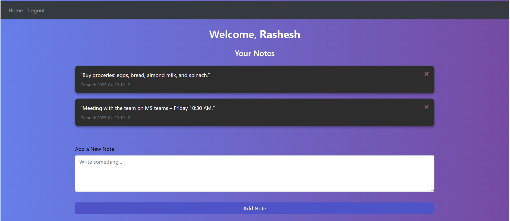

# FlaskMemo 📝

A minimal web app built with **Flask** that lets users quickly add, view, and delete memos. Designed for simplicity and speed, this app is ideal for jotting down quick notes without the clutter of complex features.

🚀 **Live Demo:**  
[https://flaskmemo.onrender.com](https://flaskmemo.onrender.com)

---

# Example Output

 

## 📚 Project Description

**FlaskMemo** is a lightweight note-taking app developed using Python's Flask framework. It demonstrates CRUD (Create, Read, Delete) operations, basic template rendering, and deployment to the cloud using Render. The goal is to offer a clean and minimal experience for users who want to write down their thoughts or reminders with zero distractions.

This project is great for:
- Beginners learning Flask
- Understanding basic web CRUD operations
- Practicing deployment using **Render**

---

## ⚙️ Features

- ✅ Add a new memo
- ✅ View all existing memos
- ✅ Delete memos when done
- ✅ Clean and responsive UI using basic HTML and CSS
- ✅ Live deployment on Render

---

## 🛠️ Tech Stack

- **Backend:** Python, Flask and JavaScript
- **Frontend:** HTML, CSS (Bootstrap optional)
- **Deployment:** Render (free hosting platform)
- **Storage:** In-memory (resets when the server restarts)

---

## 🚀 Getting Started (Run Locally)

### 1. Clone the repository

```bash
git clone https://github.com/RasheshDesai/FlaskMemo.git
cd FlaskMemo
```

### 2. Create a virtual environment

```bash
python -m venv venv
source venv/bin/activate  # On Windows: venv\Scripts\activate
```

### 3. Install dependencies

```bash
pip install -r requirements.txt
```

### 4. Run the app

```bash
python app.py
```

Now, open your browser and go to:  
👉 [http://127.0.0.1:5000](http://127.0.0.1:5000)

---

## 📦 Deployment

This app is deployed on [Render](https://render.com/), a platform for hosting web apps and APIs. The live version resets data because it's using in-memory storage — for persistence, you can integrate a database like SQLite or PostgreSQL.

---

## 🌱 Future Improvements

- [ ] Add **persistent storage** (SQLite, PostgreSQL)
- [ ] Add **Edit memo** feature
- [ ] Implement **User Authentication** for private memos
- [ ] UI improvements with modern CSS framework (e.g., Tailwind, Bootstrap 5)

---

## 🙌 Credits

Developed by [Rashesh Desai](https://github.com/RasheshDesai)  
🔗 Portfolio: [https://rasheshdesai.github.io](https://rasheshdesai.github.io/)

---

## 📄 License

This project is open source and available under the [MIT License](LICENSE).